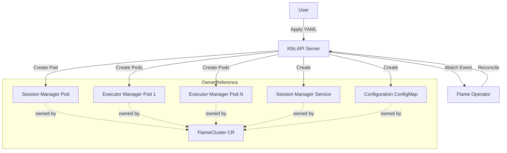

# HLD: Flame Operator MVP

## 1. Overview
This design outlines the architecture for the Flame Operator MVP, a Kubernetes Operator to manage the lifecycle of Flame clusters. It introduces a `FlameCluster` Custom Resource Definition (CRD) to automate the deployment and scaling of Flame components: the Session Manager and Executor Managers.

## 2. Motivation
Deploying distributed systems like Flame on Kubernetes manually involves managing multiple pods, services, and configurations. This is error-prone and difficult to scale. An operator simplifies this by:
- Providing a declarative API (`FlameCluster`) for the entire cluster.
- Automating the reconciliation of desired state (replicas, versions).
- Ensuring the correct startup order and configuration of components.

## 3. Background
Currently, Flame consists of:
- **Session Manager**: The central coordinator (single instance).
- **Executor Manager**: Workers that execute tasks (multiple instances).

Users manually create Pods and Services for these components. This MVP aims to replace manual manifests with a single CRD.

## 4. Use Cases
- **UC1: Deploy Flame Cluster**
  - User applies a `FlameCluster` manifest.
  - Operator creates the Session Manager Pod and Service.
  - Operator creates the Executor Manager Pods.
  - All Pods have `ownerReference` set to the `FlameCluster` CR.
  - Status is updated to `Running`.

- **UC2: Scale Executors**
  - User updates the `replicas` field in `FlameCluster`.
  - Operator creates or deletes Executor Manager Pods to match the desired count.

- **UC3: Delete Cluster**
  - User deletes the `FlameCluster` resource.
  - Kubernetes garbage collector automatically deletes all child Pods and Services (via `ownerReference`).

- **UC4: Update Configuration**
  - User updates the ConfigMap referenced by `FlameCluster`.
  - Operator detects the change and recreates affected Pods with new configuration.

## 5. Proposed Solution

### 5.1 Architecture

The operator follows the standard Kubernetes Controller pattern, managing **raw v1.Pod resources** (not Deployments) with `ownerReference` for automatic garbage collection:

1.  **CRD**: `FlameCluster` defines the spec.
2.  **Controller**: Watches `FlameCluster` resources and owned Pods.
3.  **Reconcile Loop**:
    - Check if `FlameCluster` exists.
    - **Session Manager**: Ensure a single Pod exists with `ownerReference` to FlameCluster. Ensure a Service exists for internal communication.
    - **Executor Manager**: Ensure N Pods exist (from CRD `replicas`) with `ownerReference` to FlameCluster.
    - **Configuration**: Mount ConfigMap into Pods for runtime configuration.
    - **Status**: Update `FlameCluster` status based on Pod health.

**Why v1.Pod instead of Deployment?**
- Direct control over individual pod lifecycle
- Simpler status tracking (no ReplicaSet intermediate layer)
- `ownerReference` provides automatic garbage collection
- Better suited for operator-managed workloads where each instance may need individual handling

**Component Diagram:**



### 5.2 Configuration Management

The Flame cluster requires runtime configuration for cluster settings, executor limits, and cache configuration. The operator manages this via **ConfigMap with CRD reference**.

**Configuration Strategy:**
1. **ConfigMap**: Configuration is stored in a Kubernetes ConfigMap
2. **CRD Reference**: The `FlameCluster` spec references the ConfigMap by name
3. **Volume Mount**: Operator mounts the ConfigMap into Pods at a well-known path
4. **Change Detection**: Operator watches ConfigMap changes and triggers Pod recreation


**Configuration Schema (flame-cluster.yaml):**
```yaml
cluster:
  name: flame
  endpoint: "http://flame-session-manager:8080"
  slot: "cpu=1,mem=1g"
  policy: priority
  storage: sqlite://flame.db
executors:
  shim: host
  limits:
    max_executors: 10
cache:
  endpoint: "grpc://flame-executor-manager:9090"
  network_interface: "eth0"
  storage: "/var/lib/flame/cache"
```

**ConfigMap Example:**
```yaml
apiVersion: v1
kind: ConfigMap
metadata:
  name: my-flame-config
data:
  flame-cluster.yaml: |
    cluster:
      name: flame
      endpoint: "http://my-flame-session-manager:8080"
      slot: "cpu=1,mem=1g"
      policy: priority
      storage: sqlite://flame.db
    executors:
      shim: host
      limits:
        max_executors: 10
    cache:
      endpoint: "grpc://my-flame-executor-manager:9090"
      network_interface: "eth0"
      storage: "/var/lib/flame/cache"
```

**Configuration Propagation:**
1. User creates/updates ConfigMap with Flame configuration
2. User references ConfigMap in `FlameCluster.spec.configRef`
3. Operator mounts ConfigMap as volume in Session Manager and Executor Pods
4. On ConfigMap update, operator detects change via resource version and recreates Pods

### 5.3 Data Flow
1.  User creates ConfigMap with Flame configuration.
2.  User submits `FlameCluster` manifest (referencing ConfigMap) to K8s API.
3.  Controller receives an event.
4.  Controller fetches the `FlameCluster` object and referenced ConfigMap.
5.  Controller constructs desired `Pod` and `Service` objects with:
    - `ownerReference` pointing to FlameCluster
    - ConfigMap mounted as volume
6.  Controller compares desired state with actual state in the cluster.
7.  Controller applies changes (Create/Update/Delete Pods) to K8s API.
8.  K8s scheduler places Pods on nodes.
9.  Controller updates `FlameCluster.status`.

### 5.4 APIs/Interfaces

**FlameCluster CRD (v1alpha1):**

```yaml
apiVersion: flame.xflops.io/v1alpha1
kind: FlameCluster
metadata:
  name: my-flame
spec:
  # Reference to ConfigMap containing flame-cluster.yaml
  configRef:
    name: my-flame-config        # ConfigMap name (required)
    key: flame-cluster.yaml      # Key in ConfigMap (default: flame-cluster.yaml)
  
  # Per-component configuration
  sessionManager:
    image: "xflops/flame-session:v0.1.0"  # Use explicit version tags
    resources: {}                          # Resource requirements
  executorManager:
    image: "xflops/flame-executor:v0.1.0"  # Use explicit version tags
    replicas: 3                            # Number of Executor Manager Pods
    resources: {}                          # Resource requirements
status:
  # State reflects overall cluster health
  # - Pending: Initial state, or Session Manager Pod not yet ready
  # - Running: Session Manager ready AND at least one Executor ready
  # - Failed: Session Manager Pod failed, or all Executor Pods failed
  state: "Running"
  # Session Manager health
  sessionManagerReady: true
  # Executor health tracking
  executorReplicas: 3          # Desired executor count
  readyExecutorReplicas: 3     # Current ready executor Pods
  # Configuration status
  configGeneration: 1          # Tracks ConfigMap version for change detection
  # Human-readable message for debugging
  message: "All components healthy"
```


**Pod with OwnerReference Example:**
```yaml
apiVersion: v1
kind: Pod
metadata:
  name: my-flame-session-manager
  labels:
    app: flame-session-manager
    flame.xflops.io/cluster: my-flame
  ownerReferences:
    - apiVersion: flame.xflops.io/v1alpha1
      kind: FlameCluster
      name: my-flame
      uid: <flamecluster-uid>
      controller: true
      blockOwnerDeletion: true
spec:
  containers:
    - name: session-manager
      image: xflops/flame-session:v0.1.0
      ports:
        - containerPort: 8080
      volumeMounts:
        - name: config
          mountPath: /etc/flame
          readOnly: true
      env:
        - name: FLAME_CONFIG
          value: /etc/flame/flame-cluster.yaml
  volumes:
    - name: config
      configMap:
        name: my-flame-config
```

### 5.5 Service Discovery

Executors discover the Session Manager via Kubernetes-native DNS:

1. **Session Manager Service**: The operator creates a ClusterIP Service named `<cluster-name>-session-manager` in the same namespace.
2. **DNS Resolution**: Executors connect to `<cluster-name>-session-manager.<namespace>.svc.cluster.local`.
3. **Environment Variable Injection**: The operator injects `SESSION_MANAGER_ADDR` environment variable into Executor pods with the Service DNS name.

**Example Service:**
```yaml
apiVersion: v1
kind: Service
metadata:
  name: my-flame-session-manager
  ownerReferences:
    - apiVersion: flame.xflops.io/v1alpha1
      kind: FlameCluster
      name: my-flame
      uid: <flamecluster-uid>
      controller: true
      blockOwnerDeletion: true
spec:
  selector:
    app: flame-session-manager
    flame.xflops.io/cluster: my-flame
  ports:
    - port: 8080
      targetPort: 8080
```

#### Object Cache Service

The operator also creates a ClusterIP Service for the object cache, enabling distributed caching across the cluster:

1. **Object Cache Service**: The operator creates a ClusterIP Service named `<cluster-name>-object-cache` in the same namespace.
2. **DNS Resolution**: Components connect to `<cluster-name>-object-cache.<namespace>.svc.cluster.local` for cache operations.
3. **Environment Variable Injection**: The operator injects `OBJECT_CACHE_ADDR` environment variable into all Flame pods with the Service DNS name and gRPC port.

**Example Object Cache Service:**
```yaml
apiVersion: v1
kind: Service
metadata:
  name: my-flame-object-cache
  ownerReferences:
    - apiVersion: flame.xflops.io/v1alpha1
      kind: FlameCluster
      name: my-flame
      uid: <flamecluster-uid>
      controller: true
      blockOwnerDeletion: true
spec:
  selector:
    app: flame-executor-manager
    flame.xflops.io/cluster: my-flame
  ports:
    - name: grpc
      port: 9090
      targetPort: 9090
      protocol: TCP
```

**Service Discovery Summary:**

| Service | DNS Name | Port | Environment Variable |
|---------|----------|------|---------------------|
| Session Manager | `<cluster>-session-manager.<ns>.svc.cluster.local` | 8080 (HTTP) | `SESSION_MANAGER_ADDR` |
| Object Cache | `<cluster>-object-cache.<ns>.svc.cluster.local` | 9090 (gRPC) | `OBJECT_CACHE_ADDR` |

## 6. Alternatives Considered

| Option | Pros | Cons | Decision |
| :--- | :--- | :--- | :--- |
| **Helm Chart** | Simple to package, standard tool. | No active reconciliation loop; Day 2 ops (auto-healing) are limited. | ❌ Rejected (for now, Operator preferred for lifecycle) |
| **Manual Manifests** | No extra tooling required. | High operational burden; error-prone. | ❌ Rejected |
| **Operator (Go/Kubebuilder)** | Full control, active reconciliation, extensible. | Development effort required. | ✅ Selected |
| **Deployments** | Built-in rolling updates, ReplicaSet management. | Extra abstraction layer, less direct control over individual pods. | ❌ Rejected (Pods with ownerReference preferred) |
| **Config in CRD spec** | Single source of truth. | Large configs bloat CRD, harder to manage. | ❌ Rejected |
| **ConfigMap with reference** | Separation of concerns, easy to update, standard K8s pattern. | Requires watching additional resource. | ✅ Selected |


## 7. Risks & Mitigations

| Risk | Impact | Mitigation |
| :--- | :--- | :--- |
| **Race Conditions** | Executors might start before Session Manager is ready. | **Service Discovery + Readiness Gates**: (1) Executors discover Session Manager via Kubernetes Service DNS (`<cluster>-session-manager.<ns>.svc`). (2) Executor pods use an InitContainer that waits for Session Manager Service endpoint to be ready. (3) Session Manager Pod has readiness probe; Service only routes to ready pods. This ensures Executors block until Session Manager is accepting connections. |
| **Resource Contention** | Executors might consume all node resources. | Enforce resource requests/limits in the CRD and pass them to Pods. |
| **CRD Schema Changes** | Breaking changes in future versions. | Use API versioning (v1alpha1 -> v1beta1) and conversion webhooks if needed later. |
| **Pod Management Complexity** | Managing individual Pods is more complex than Deployments. | Operator handles all Pod lifecycle; status tracking simplified without ReplicaSet layer. |
| **Configuration Drift** | ConfigMap changes not reflected in running Pods. | Operator watches ConfigMap, recreates Pods on change, tracks `configGeneration` in status. |
| **Orphaned Resources** | Child resources not cleaned up on FlameCluster deletion. | All Pods and Services have `ownerReference` to FlameCluster; Kubernetes GC handles cleanup automatically. |

## 8. Success Metrics
- A user can deploy a working cluster with `kubectl apply -f flame.yaml`.
- Changing `spec.executorManager.replicas` scales the Executor pods within seconds.
- `kubectl get flamecluster` shows the correct status including both Session Manager and Executor health.
- Deleting `FlameCluster` automatically cleans up all Pods and Services (via ownerReference).
- Updating ConfigMap triggers Pod recreation with new configuration.

## 9. Out of Scope
- **Advanced Networking**: Ingress or external access (MVP focuses on internal cluster).
- **Storage**: Persistent storage for Session Manager (state is ephemeral for MVP).
- **Multi-cluster**: Federation or multi-cluster management.
- **Metrics/Monitoring**: Prometheus integration (can be added later).
- **Configuration Validation**: Schema validation of flame-cluster.yaml (can be added later).
