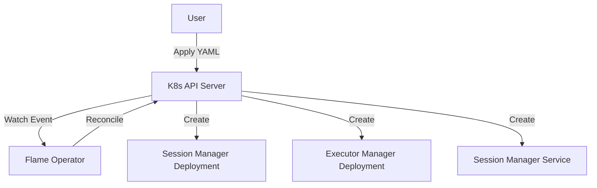

# HLD: Flame Operator MVP

## 1. Overview
This design outlines the architecture for the Flame Operator MVP, a Kubernetes Operator to manage the lifecycle of Flame clusters. It introduces a `FlameCluster` Custom Resource Definition (CRD) to automate the deployment and scaling of Flame components: the Session Manager and Executor Managers.

## 2. Motivation
Deploying distributed systems like Flame on Kubernetes manually involves managing multiple deployments, services, and configurations. This is error-prone and difficult to scale. An operator simplifies this by:
- Providing a declarative API (`FlameCluster`) for the entire cluster.
- Automating the reconciliation of desired state (replicas, versions).
- Ensuring the correct startup order and configuration of components.

## 3. Background
Currently, Flame consists of:
- **Session Manager**: The central coordinator (single instance).
- **Executor Manager**: Workers that execute tasks (multiple instances).

Users manually create Deployments and Services for these components. This MVP aims to replace manual manifests with a single CRD.

## 4. Use Cases
- **UC1: Deploy Flame Cluster**
  - User applies a `FlameCluster` manifest.
  - Operator creates the Session Manager deployment and service.
  - Operator creates the Executor Manager deployment.
  - Status is updated to `Running`.

- **UC2: Scale Executors**
  - User updates the `replicas` field in `FlameCluster`.
  - Operator updates the Executor Manager deployment to match the desired count.

- **UC3: Delete Cluster**
  - User deletes the `FlameCluster` resource.
  - Operator (via OwnerReferences) ensures all child resources (Deployments, Services) are garbage collected.

## 5. Proposed Solution

### 5.1 Architecture

The operator follows the standard Kubernetes Controller pattern:
1.  **CRD**: `FlameCluster` defines the spec.
2.  **Controller**: Watches `FlameCluster` resources.
3.  **Reconcile Loop**:
    - Check if `FlameCluster` exists.
    - **Session Manager**: Ensure a Deployment exists with `replicas: 1`. Ensure a Service exists for internal communication.
    - **Executor Manager**: Ensure a Deployment exists with `replicas: N` (from CRD).
    - **Status**: Update `FlameCluster` status based on the health of child resources.

**Component Diagram:**


### 5.2 Data Flow
1.  User submits `FlameCluster` manifest to K8s API.
2.  Controller receives an event.
3.  Controller fetches the `FlameCluster` object.
4.  Controller constructs desired `Deployment` and `Service` objects.
5.  Controller compares desired state with actual state in the cluster.
6.  Controller applies changes (Create/Update) to K8s API.
7.  K8s Deployment controller starts Pods.
8.  Controller updates `FlameCluster.status`.

### 5.3 APIs/Interfaces

**FlameCluster CRD (v1alpha1):**

```yaml
apiVersion: flame.xflops.io/v1alpha1
kind: FlameCluster
metadata:
  name: my-flame
spec:
  # Per-component image configuration for independent versioning
  sessionManager:
    image: "xflops/flame-session:v0.1.0"  # Use explicit version tags
    resources: {}                          # Resource requirements
  executorManager:
    image: "xflops/flame-executor:v0.1.0"  # Use explicit version tags
    replicas: 3                            # Number of Executor Managers
    resources: {}                          # Resource requirements
status:
  # State reflects overall cluster health
  # - Pending: Initial state, or Session Manager not yet ready
  # - Running: Session Manager ready AND at least one Executor ready
  # - Failed: Session Manager failed to start, or all Executors failed
  state: "Running"
  # Session Manager health
  sessionManagerReady: true
  # Executor health tracking
  executorReplicas: 3          # Desired executor count
  readyExecutorReplicas: 3     # Current ready executors
  # Human-readable message for debugging
  message: "All components healthy"
```

### 5.4 Service Discovery

Executors discover the Session Manager via Kubernetes-native DNS:

1. **Session Manager Service**: The operator creates a ClusterIP Service named `<cluster-name>-session-manager` in the same namespace.
2. **DNS Resolution**: Executors connect to `<cluster-name>-session-manager.<namespace>.svc.cluster.local`.
3. **Environment Variable Injection**: The operator injects `SESSION_MANAGER_ADDR` environment variable into Executor pods with the Service DNS name.

**Example Service:**
```yaml
apiVersion: v1
kind: Service
metadata:
  name: my-flame-session-manager
spec:
  selector:
    app: flame-session-manager
    flame.xflops.io/cluster: my-flame
  ports:
    - port: 8080
      targetPort: 8080
```

## 6. Alternatives Considered

| Option | Pros | Cons | Decision |
| :--- | :--- | :--- | :--- |
| **Helm Chart** | Simple to package, standard tool. | No active reconciliation loop; Day 2 ops (auto-healing) are limited. | ❌ Rejected (for now, Operator preferred for lifecycle) |
| **Manual Manifests** | No extra tooling required. | High operational burden; error-prone. | ❌ Rejected |
| **Operator (Go/Kubebuilder)** | Full control, active reconciliation, extensible. | Development effort required. | ✅ Selected |

## 7. Risks & Mitigations

| Risk | Impact | Mitigation |
| :--- | :--- | :--- |
| **Race Conditions** | Executors might start before Session Manager is ready. | **Service Discovery + Readiness Gates**: (1) Executors discover Session Manager via Kubernetes Service DNS (`<cluster>-session-manager.<ns>.svc`). (2) Executor pods use an InitContainer that waits for Session Manager Service endpoint to be ready. (3) Session Manager Deployment has readiness probe; Service only routes to ready pods. This ensures Executors block until Session Manager is accepting connections. |
| **Resource Contention** | Executors might consume all node resources. | Enforce resource requests/limits in the CRD and pass them to Deployments. |
| **CRD Schema Changes** | Breaking changes in future versions. | Use API versioning (v1alpha1 -> v1beta1) and conversion webhooks if needed later. |

## 8. Success Metrics
- A user can deploy a working cluster with `kubectl apply -f flame.yaml`.
- Changing `spec.executorManager.replicas` scales the Executor pods within seconds.
- `kubectl get flamecluster` shows the correct status including both Session Manager and Executor health.

## 9. Out of Scope
- **Advanced Networking**: Ingress or external access (MVP focuses on internal cluster).
- **Storage**: Persistent storage for Session Manager (state is ephemeral for MVP).
- **Multi-cluster**: Federation or multi-cluster management.
- **Metrics/Monitoring**: Prometheus integration (can be added later).
