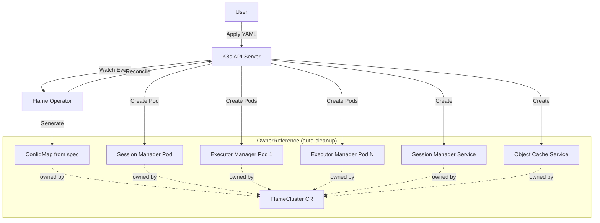

# HLD: Flame Operator MVP

## 1. Overview
This design outlines the architecture for the Flame Operator MVP, a Kubernetes Operator to manage the lifecycle of Flame clusters. It introduces a `FlameCluster` Custom Resource Definition (CRD) to automate the deployment and scaling of Flame components: the Session Manager and Executor Managers.

## 2. Motivation
Deploying distributed systems like Flame on Kubernetes manually involves managing multiple pods, services, and configurations. This is error-prone and difficult to scale. An operator simplifies this by:
- Providing a declarative API (`FlameCluster`) for the entire cluster.
- Automating the reconciliation of desired state (replicas, versions).
- Ensuring the correct startup order and configuration of components.

## 3. Background
Currently, Flame consists of:
- **Session Manager**: The central coordinator (single instance).
- **Executor Manager**: Workers that execute tasks (multiple instances).

Users manually create Pods and Services for these components. This MVP aims to replace manual manifests with a single CRD.

## 4. Use Cases
- **UC1: Deploy Flame Cluster**
  - User applies a `FlameCluster` manifest with embedded configuration.
  - Operator generates a ConfigMap from `FlameCluster.spec` component configurations.
  - Operator creates the Session Manager Pod and Service.
  - Operator creates the Object Cache Service.
  - Operator creates the Executor Manager Pods.
  - All resources have `ownerReference` set to the `FlameCluster` CR.
  - Status is updated to `Running`.

- **UC2: Scale Executors**
  - User updates the `replicas` field in `FlameCluster`.
  - Operator creates or deletes Executor Manager Pods to match the desired count.

- **UC3: Delete Cluster**
  - User deletes the `FlameCluster` resource.
  - Kubernetes garbage collector automatically deletes all child resources (Pods, Services, ConfigMap) via `ownerReference`.

- **UC4: Update Configuration**
  - User updates configuration fields in `FlameCluster.spec`.
  - Operator regenerates the ConfigMap with new values.
  - Operator recreates affected Pods with new configuration.

## 5. Proposed Solution

### 5.1 Architecture

The operator follows the standard Kubernetes Controller pattern, managing **raw v1.Pod resources** (not Deployments) with `ownerReference` for automatic garbage collection:

1.  **CRD**: `FlameCluster` defines the spec including embedded configuration.
2.  **Controller**: Watches `FlameCluster` resources and owned resources (Pods, Services, ConfigMap).
3.  **Reconcile Loop**:
    - Check if `FlameCluster` exists.
    - **ConfigMap**: Generate ConfigMap from `FlameCluster.spec` component configurations with `ownerReference`.
    - **Session Manager**: Ensure a single Pod exists with `ownerReference` to FlameCluster.
    - **Services**: Create Session Manager Service and Object Cache Service with `ownerReference`.
    - **Executor Manager**: Ensure N Pods exist (from CRD `replicas`) with `ownerReference` to FlameCluster.
    - **Configuration Mount**: Mount operator-generated ConfigMap into all Pods.
    - **Status**: Update `FlameCluster` status based on Pod health.

**Why v1.Pod instead of Deployment?**
- Direct control over individual pod lifecycle
- Simpler status tracking (no ReplicaSet intermediate layer)
- `ownerReference` provides automatic garbage collection
- Better suited for operator-managed workloads where each instance may need individual handling


**Component Diagram:**



### 5.2 Configuration Management

The Flame cluster requires runtime configuration for cluster settings, executor limits, and cache configuration. The operator manages this via **embedded configuration in CRD spec** with operator-generated ConfigMap.

**Configuration Strategy:**
1. **Embedded in CRD**: Configuration is specified directly in component specs (`sessionManager`, `executorManager`, `objectCache`)
2. **Operator-Generated ConfigMap**: Operator generates a ConfigMap from spec values
3. **Lifecycle Management**: ConfigMap is created, updated, and deleted with the FlameCluster
4. **Volume Mount**: Operator mounts the generated ConfigMap into all Pods at `/etc/flame`
5. **Change Detection**: Changes to component specs trigger ConfigMap regeneration and Pod recreation
6. **Auto-Generated Name**: Cluster name is derived from `metadata.name` (not user-specified)

**Benefits of Embedded Configuration:**
- **Single source of truth**: All cluster configuration in one manifest
- **Atomic updates**: Configuration changes are versioned with the FlameCluster
- **No orphaned ConfigMaps**: Operator manages full lifecycle
- **Validation**: CRD schema can validate configuration at admission time
- **GitOps friendly**: Entire cluster state in one resource

**Configuration Fields:**

| Component | Field | Description |
|-----------|-------|-------------|
| `sessionManager` | `endpoint` | Session Manager endpoint (auto-generated from Service) |
| `sessionManager` | `slot` | Resource slot definition (e.g., "cpu=1,mem=1g") |
| `sessionManager` | `policy` | Scheduling policy (e.g., "priority") |
| `sessionManager` | `storage` | Storage backend URI |
| `executorManager` | `shim` | Executor shim type (e.g., "host") |
| `executorManager` | `maxExecutors` | Maximum executor count |
| `objectCache` | `endpoint` | Object cache endpoint (auto-generated from Service) |
| `objectCache` | `networkInterface` | Network interface for cache |
| `objectCache` | `storage` | Cache storage path |

**Operator-Generated Values:**
The operator automatically generates certain configuration values based on the cluster:
- `sessionManager.endpoint`: Set to `http://<metadata.name>-session-manager:8080`
- `objectCache.endpoint`: Set to `grpc://<metadata.name>-object-cache:9090`
- Cluster name: Derived from `metadata.name`


### 5.3 Data Flow
1.  User submits `FlameCluster` manifest with embedded configuration to K8s API.
2.  Controller receives an event.
3.  Controller fetches the `FlameCluster` object.
4.  Controller generates ConfigMap from component specs with auto-populated endpoints (using `metadata.name` as cluster name).
5.  Controller constructs desired `Pod` and `Service` objects with:
    - `ownerReference` pointing to FlameCluster
    - Generated ConfigMap mounted as volume
6.  Controller compares desired state with actual state in the cluster.
7.  Controller applies changes (Create/Update/Delete) to K8s API.
8.  K8s scheduler places Pods on nodes.
9.  Controller updates `FlameCluster.status`.

### 5.4 APIs/Interfaces

**FlameCluster CRD (v1alpha1):**

```yaml
apiVersion: flame.xflops.io/v1alpha1
kind: FlameCluster
metadata:
  name: my-flame                              # Cluster name (used for all naming)
spec:
  # Session Manager configuration (merged from former config.cluster)
  sessionManager:
    image: "xflops/flame-session:v0.1.0"      # Use explicit version tags
    resources: {}                              # Resource requirements
    # endpoint: auto-generated from Service DNS
    slot: "cpu=1,mem=1g"                       # Resource slot definition
    policy: priority                           # Scheduling policy
    storage: sqlite://flame.db                 # Storage backend
  
  # Executor Manager configuration (merged from former config.executors)
  executorManager:
    image: "xflops/flame-executor:v0.1.0"     # Use explicit version tags
    replicas: 3                                # Number of Executor Manager Pods
    resources: {}                              # Resource requirements
    shim: host                                 # Executor shim type
    maxExecutors: 10                           # Maximum executor count
  
  # Object Cache configuration (moved from former config.cache)
  objectCache:
    # endpoint: auto-generated from Service DNS
    networkInterface: "eth0"                   # Network interface for cache
    storage: "/var/lib/flame/cache"            # Cache storage path

status:
  # Session Manager status aggregation
  sessionManager:
    ready: 1                                   # Number of ready Session Manager instances (int for future HA)
    endpoint: "http://my-flame-session-manager:8080"
  
  # Executor Manager status aggregation
  executorManager:
    replicas: 3                                # Desired executor count
    ready: 3                                   # Number of ready Executor Manager Pods (int for HA)
  
  # Overall cluster state
  # - Pending: Initial state, or Session Manager Pod not yet ready
  # - Running: Session Manager ready AND at least one Executor ready
  # - Failed: Session Manager Pod failed, or all Executor Pods failed
  state: "Running"
  
  # Configuration status
  configGeneration: 1                          # Tracks config version for change detection
  
  # Human-readable message for debugging
  message: "All components healthy"
```


**Operator-Generated ConfigMap:**

The operator generates a ConfigMap from component specs with auto-populated Service endpoints:

```yaml
apiVersion: v1
kind: ConfigMap
metadata:
  name: my-flame-config
  ownerReferences:
    - apiVersion: flame.xflops.io/v1alpha1
      kind: FlameCluster
      name: my-flame
      uid: <flamecluster-uid>
      controller: true
      blockOwnerDeletion: true
data:
  flame-cluster.yaml: |
    cluster:
      name: my-flame                                    # From metadata.name
      endpoint: "http://my-flame-session-manager:8080"  # Auto-generated
      slot: "cpu=1,mem=1g"                              # From sessionManager.slot
      policy: priority                                  # From sessionManager.policy
      storage: sqlite://flame.db                        # From sessionManager.storage
    executors:
      shim: host                                        # From executorManager.shim
      limits:
        max_executors: 10                               # From executorManager.maxExecutors
    cache:
      endpoint: "grpc://my-flame-object-cache:9090"     # Auto-generated
      network_interface: "eth0"                         # From objectCache.networkInterface
      storage: "/var/lib/flame/cache"                   # From objectCache.storage
```

**Pod with OwnerReference Example:**
```yaml
apiVersion: v1
kind: Pod
metadata:
  name: my-flame-session-manager
  labels:
    app: flame-session-manager
    flame.xflops.io/cluster: my-flame
  ownerReferences:
    - apiVersion: flame.xflops.io/v1alpha1
      kind: FlameCluster
      name: my-flame
      uid: <flamecluster-uid>
      controller: true
      blockOwnerDeletion: true
spec:
  containers:
    - name: session-manager
      image: xflops/flame-session:v0.1.0
      ports:
        - containerPort: 8080
      volumeMounts:
        - name: config
          mountPath: /etc/flame
          readOnly: true
      env:
        - name: FLAME_CONFIG
          value: /etc/flame/flame-cluster.yaml
  volumes:
    - name: config
      configMap:
        name: my-flame-config  # Operator-generated ConfigMap
```


### 5.5 Service Discovery

The operator creates and manages Services for inter-component communication. All Services have `ownerReference` to the FlameCluster for automatic cleanup.

#### Session Manager Service

Executors discover the Session Manager via Kubernetes-native DNS:

1. **Session Manager Service**: The operator creates a ClusterIP Service named `<metadata.name>-session-manager` in the same namespace.
2. **DNS Resolution**: Executors connect to `<metadata.name>-session-manager.<namespace>.svc.cluster.local`.
3. **Environment Variable Injection**: The operator injects `SESSION_MANAGER_ADDR` environment variable into Executor pods with the Service DNS name.

**Example Service:**
```yaml
apiVersion: v1
kind: Service
metadata:
  name: my-flame-session-manager
  ownerReferences:
    - apiVersion: flame.xflops.io/v1alpha1
      kind: FlameCluster
      name: my-flame
      uid: <flamecluster-uid>
      controller: true
      blockOwnerDeletion: true
spec:
  selector:
    app: flame-session-manager
    flame.xflops.io/cluster: my-flame
  ports:
    - port: 8080
      targetPort: 8080
```

#### Object Cache Service

The operator also creates a ClusterIP Service for the object cache, enabling distributed caching across the cluster:

1. **Object Cache Service**: The operator creates a ClusterIP Service named `<metadata.name>-object-cache` in the same namespace.
2. **DNS Resolution**: Components connect to `<metadata.name>-object-cache.<namespace>.svc.cluster.local` for cache operations.
3. **Environment Variable Injection**: The operator injects `OBJECT_CACHE_ADDR` environment variable into all Flame pods with the Service DNS name and gRPC port.

**Example Object Cache Service:**
```yaml
apiVersion: v1
kind: Service
metadata:
  name: my-flame-object-cache
  ownerReferences:
    - apiVersion: flame.xflops.io/v1alpha1
      kind: FlameCluster
      name: my-flame
      uid: <flamecluster-uid>
      controller: true
      blockOwnerDeletion: true
spec:
  selector:
    app: flame-executor-manager
    flame.xflops.io/cluster: my-flame
  ports:
    - name: grpc
      port: 9090
      targetPort: 9090
      protocol: TCP
```

**Service Discovery Summary:**

| Service | DNS Name | Port | Environment Variable | Auto-Generated Config |
|---------|----------|------|---------------------|----------------------|
| Session Manager | `<name>-session-manager.<ns>.svc.cluster.local` | 8080 (HTTP) | `SESSION_MANAGER_ADDR` | `sessionManager.endpoint` |
| Object Cache | `<name>-object-cache.<ns>.svc.cluster.local` | 9090 (gRPC) | `OBJECT_CACHE_ADDR` | `objectCache.endpoint` |


## 6. Alternatives Considered

| Option | Pros | Cons | Decision |
| :--- | :--- | :--- | :--- |
| **Helm Chart** | Simple to package, standard tool. | No active reconciliation loop; Day 2 ops (auto-healing) are limited. | ❌ Rejected (for now, Operator preferred for lifecycle) |
| **Manual Manifests** | No extra tooling required. | High operational burden; error-prone. | ❌ Rejected |
| **Operator (Go/Kubebuilder)** | Full control, active reconciliation, extensible. | Development effort required. | ✅ Selected |
| **Deployments** | Built-in rolling updates, ReplicaSet management. | Extra abstraction layer, less direct control over individual pods. | ❌ Rejected (Pods with ownerReference preferred) |
| **ConfigMap with external reference** | Separation of concerns. | User must manage ConfigMap separately, risk of orphaned configs, two resources to manage. | ❌ Rejected |
| **Config embedded in CRD spec** | Single source of truth, operator manages lifecycle, atomic updates, GitOps friendly. | Slightly larger CRD manifest. | ✅ Selected |
| **Nested config block** | Logical grouping of configuration. | Extra nesting level, harder to extend per-component. | ❌ Rejected |
| **Config merged into component specs** | Flat structure, component-centric, easier to extend per-component. | Configuration spread across multiple sections. | ✅ Selected |


## 7. Risks & Mitigations

| Risk | Impact | Mitigation |
| :--- | :--- | :--- |
| **Race Conditions** | Executors might start before Session Manager is ready. | **Service Discovery + Readiness Gates**: (1) Executors discover Session Manager via Kubernetes Service DNS (`<name>-session-manager.<ns>.svc`). (2) Executor pods use an InitContainer that waits for Session Manager Service endpoint to be ready. (3) Session Manager Pod has readiness probe; Service only routes to ready pods. This ensures Executors block until Session Manager is accepting connections. |
| **Resource Contention** | Executors might consume all node resources. | Enforce resource requests/limits in the CRD and pass them to Pods. |
| **CRD Schema Changes** | Breaking changes in future versions. | Use API versioning (v1alpha1 -> v1beta1) and conversion webhooks if needed later. |
| **Pod Management Complexity** | Managing individual Pods is more complex than Deployments. | Operator handles all Pod lifecycle; status tracking simplified without ReplicaSet layer. |
| **Configuration Drift** | Configuration changes not reflected in running Pods. | Operator watches component spec changes, regenerates ConfigMap, and recreates Pods. Tracks `configGeneration` in status. |
| **Orphaned Resources** | Child resources not cleaned up on FlameCluster deletion. | All Pods, Services, and ConfigMap have `ownerReference` to FlameCluster; Kubernetes GC handles cleanup automatically. |
| **Invalid Configuration** | User provides invalid config values. | CRD schema validation at admission time; operator validates before generating ConfigMap. |


## 8. Success Metrics
- A user can deploy a working cluster with a single `kubectl apply -f flamecluster.yaml` (no separate ConfigMap needed).
- Changing `spec.executorManager.replicas` scales the Executor pods within seconds.
- Changing component spec values triggers automatic ConfigMap regeneration and Pod recreation.
- `kubectl get flamecluster` shows the correct status including `sessionManager` and `executorManager` health.
- Deleting `FlameCluster` automatically cleans up all Pods, Services, and ConfigMap (via ownerReference).
- Services are automatically created with correct DNS names for inter-component communication.

## 9. Out of Scope
- **Advanced Networking**: Ingress or external access (MVP focuses on internal cluster).
- **Storage**: Persistent storage for Session Manager (state is ephemeral for MVP).
- **Multi-cluster**: Federation or multi-cluster management.
- **Metrics/Monitoring**: Prometheus integration (can be added later).
- **Configuration Validation**: Deep schema validation of config values beyond CRD types (can be added later).
- **HA Session Manager**: Multiple Session Manager instances (status uses int for future HA support).
